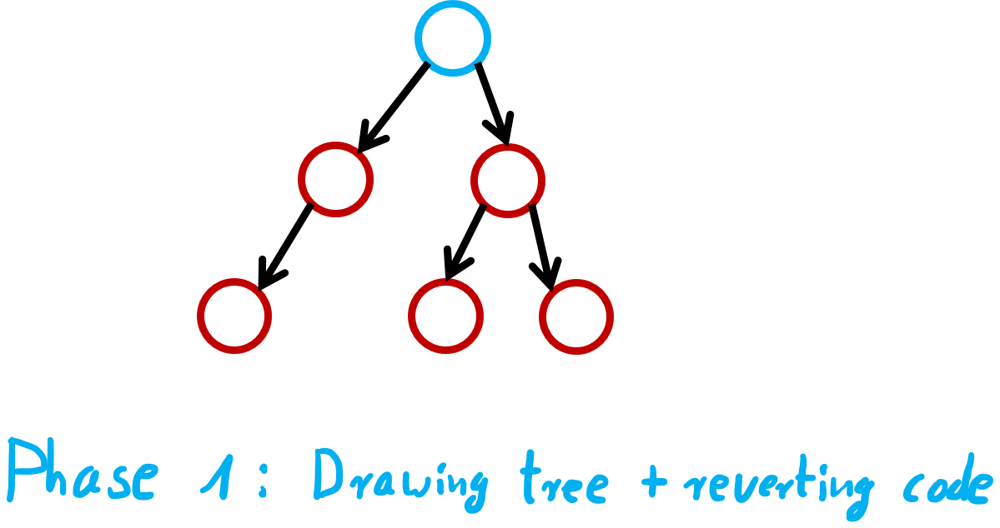
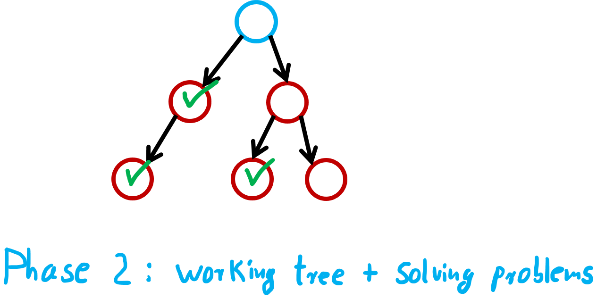

# Mikado Method
## Problem

Problem: a simple refactoring ...

... leads to another necessary refactoring

That way, a tree of dependent refactorings is created 

Solution: only handle one issue at a time

## Algorithm
1. attempt refactoring
2. run into some issue
3. write down information about issue in a graph (first refactoring = parent, new issue = child)
4. revert all changes
5. begin refactoring issue => 1. step 
6. repeat until all issues are doable (= leaves of the graph)
7. refactor issues from leaves to the root of the graph

With this algorithm, the tree will be resolved by doing one tiny refactoring after the other, ...

... until the first refactoring can be implemented without problems. 

## Exercises
Taken from [Mikado method examples and exercises](https://github.com/mikadomethod), [here](spaceExercise/README.md) are three exercises for the method, including a sample codebase. 

## Tipps
- (huge) Mikado graph can be processed over time instead of in one huge leap. Attention: Too much time = possible changes in graph due to changed codebase 

## Sources
- Stefan Lieser "Die Mikado Methode" ([youtube](https://www.youtube.com/watch?v=qtIGDc6LTls))
- [Mikado method examples and exercises](https://github.com/mikadomethod)
- [Home of the Mikado Method](https://mikadomethod.wordpress.com)